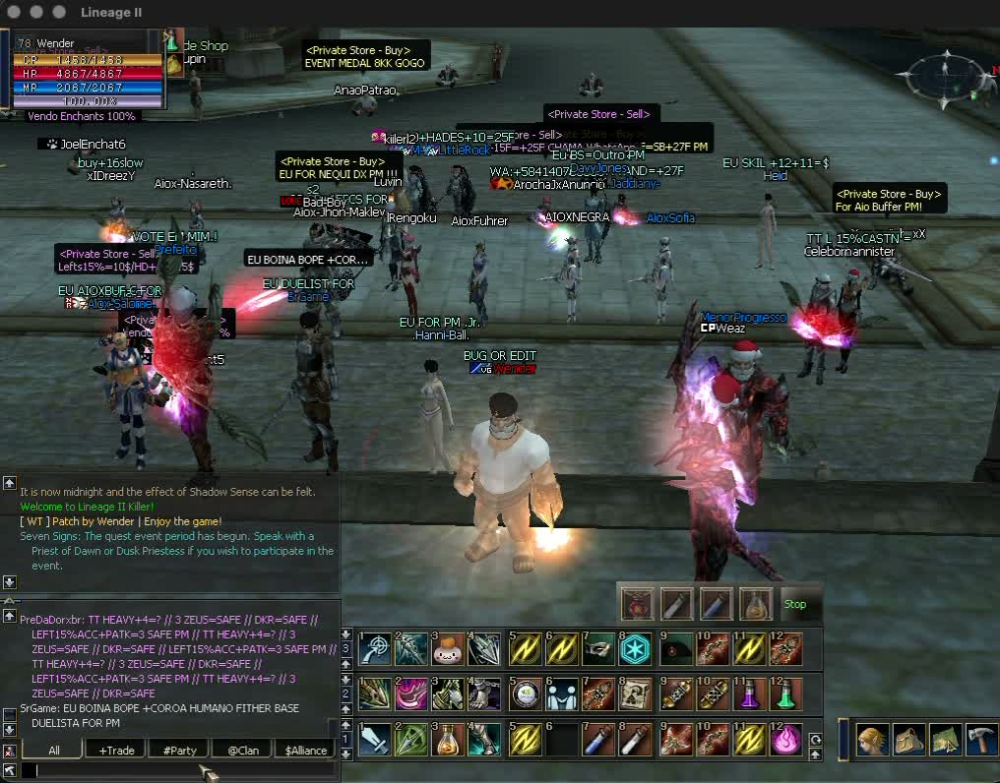

# L2Killer Interface · WT

Interface para o **Lineage II C4 do L2Killer**, feita por **Wender Teixeira (WT)**.
Três barras de atalhos, Auto Potion e equipamentos do alvo no cliente clássico.

**[Baixar a system pronta](https://interface.unkbot.com/downloads/L2Killer-System-WT.zip)** · **[Ver a demonstração](https://interface.unkbot.com/#demo-title)** · **[Releases](https://github.com/w3nder/l2killer-interface/releases)**

> Projeto independente de um player. Não é uma interface oficial e não tem
> vínculo com o dono ou a administração do L2Killer.

## O que tem na 1.1.1

| Recurso | Como funciona |
| --- | --- |
| Três barras | Páginas independentes, seletores, recolhimento e descrição dos itens. |
| Auto Potion | CP, HP, Mana e Quick HP. Arraste os itens, escolha percentual, intervalo ou ambos e ative. |
| Configuração salva | Poções e preferências restauradas ao entrar, janela móvel e controle na barra compacta. |
| Uso manual prioritário | Usar um item manualmente cede prioridade ao jogador enquanto aguarda a atualização do inventário. |
| Equipamentos do alvo | Ícones de 14 px abaixo de clan/ally, nomes e enchant recebido da arma ao passar o mouse. |
| Visual local | Efeito de hero e cor do nome por comandos, só no seu personagem e na sua tela. |

**Validada por WT no Windows 11 e no Wine.** Outros clientes e versões de DLL não
são compatíveis automaticamente. O patch só mostra equipamentos recebidos pelo
cliente; não revela inventários, joias ausentes ou enchant das armaduras.

### Correção da 1.1.1

Auto Potion avalia todos os canais antes de enviar os pedidos. CP, HP, Mana e
Quick HP podem ser solicitadas na mesma atualização, sem esperar outra poção
completar. Configurações individuais e prioridade manual são preservadas.
Correção validada por WT no Windows.

## Instalar

1. Se ainda não tem o cliente, [baixe o jogo completo no site do L2Killer](https://l2killer.org/?page=download).
2. Feche o jogo e renomeie sua pasta `system` para `system-backup`.
3. Extraia o ZIP da WT e coloque a pasta `system` no lugar da antiga.
4. Abra `system/l2.exe`. Arraste suas poções e ative o Auto Potion no primeiro uso.

O ZIP já está compilado. Não precisa instalar ferramentas de desenvolvimento.
Para desfazer, restaure a pasta anterior inteira. O download não inclui o cliente
completo nem o Wine.

## Atalhos e comandos

| Ação | Atalho ou comando |
| --- | --- |
| Primeira barra | F1–F12 |
| Segunda barra | Alt + F1–F12 |
| Terceira barra | Ctrl + Alt + F1–F12 |
| Ligar efeito de hero | `!hero_on` |
| Desligar efeito de hero | `!hero_off` ou `_hero_off` |
| Nick vermelho | `!color_name FF0000` |

A cor aceita seis dígitos hexadecimais RRGGBB. Hero e cor valem durante a sessão,
não concedem status ou habilidades no servidor e não alteram outros jogadores.
Os comandos locais não são enviados ao chat do servidor.

Em `C4Bars.ini`, use `ShowCredit=0` para ocultar o crédito e `TargetEquipment=0`
para desligar a exibição de equipamentos, ambos na seção `[C4Bars]`.

## Desenvolvimento

O código aqui é do patch, não do cliente original. As alterações usam C++ e
assembly x86, com endereços conferidos por engenharia reversa para este cliente.

- **[Compilar e testar](docs/building.md)** — dependências, hash da DLL original e comandos.
- **[Contribuir](CONTRIBUTING.md)** — fluxo de branches e validação das mudanças.
- **[Reportar um bug](https://github.com/w3nder/l2killer-interface/issues/new/choose)** — reprodução e ambiente.
- **[Notas dos equipamentos](docs/target-equipment.md)** e **[comandos locais](docs/local-appearance.md)** — detalhes do mapeamento.

| Caminho | Conteúdo |
| --- | --- |
| `patch/C4Bars.cpp` | Integração das barras, entrada, tooltip e crédito |
| `patch/auto_potion.h` | Auto Potion e preferências |
| `patch/native_potion_window.h` | Janela nativa de configuração |
| `patch/manual_item_priority.h` | Prioridade do uso manual |
| `patch/target_equipment.h` | Equipamentos do alvo e enchant da arma |
| `patch/local_appearance.h` | Comandos de hero e cor do nome |
| `patch/build_patch.py` | Build x86 e validação do binário de entrada |
| `patch/test_*` | Testes nativos e emulação x86 |
| `docs/release-v*.json` | Manifestos e hashes das distribuições |

`main` acompanha a versão distribuída. Novas mudanças entram em `develop` e só
viram release depois dos testes no jogo. A automação não substitui a validação
visual e de inicialização no Windows. O Wine pode apresentar falhas intermitentes
na inicialização gráfica. Descarregar a DLL durante o jogo não é suportado.

## Licença e autoria

Código do patch sob a [licença MIT](LICENSE). Copyright © 2026 Wender Teixeira (WT).
A licença cobre o código original deste projeto; não licencia o cliente Lineage II,
as DLLs originais, texturas, marcas ou demais materiais de terceiros nos pacotes.
